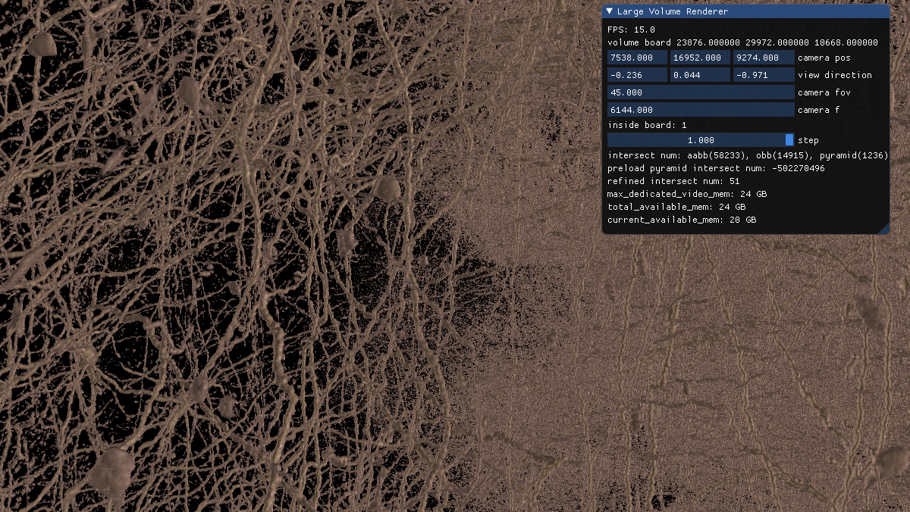

## 需要安装其他软件
    U盘: 安装 ventoy 后携带 Windows10安装包
    CUDA
    MPI:msmpisetup.exe msmpisdk.msi
    v2ray-windows-64
    git
    cmake
    visual-studio-2019
    clion
## 环境配置
    环境变量 Path : 主要是MPI
    
## 渲染程序配置
    render_cofig.json
    文件路径需要正确
## MPI配置
    smpd.exe -d
    mpiexec -hosts 2 10.189.204.238 2 10.189.74.69 2 renderer.exe
    or mpiexec.exe -hosts host_num host0_ip process_num_in_host0 host1_ip process_num_in_host1 renderer.exe [arg_for_renderer]
    
## ScreenShot
